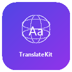

<div align="center">



# TranslateKit

**Multi-provider AI translation plugin for [MT Manager](https://mt2.cn)**

[](https://github.com/ilker-binzet/TranslateKit/releases)
[](https://gitee.com/AntlersMa/mt-plugin-sdk)
[](LICENSE)
[](#)

*Translate Android string resources using Gemini, OpenAI, or Claude — all from a single plugin.*

</div>

---

## Overview

TranslateKit brings the power of modern AI translation directly into MT Manager. Instead of switching between multiple tools or browser tabs, you configure your API keys once and translate strings with a tap.

The plugin supports three AI providers and Google Cloud Translation, with built-in context presets, tone controls, and retry logic — making it suitable for everything from casual app localization to production-grade translation workflows.

---

## Features

### Multi-Provider Architecture
| Provider | Models | Free Tier |
|----------|--------|-----------|
| **Google Gemini** | Gemini 3 Pro/Flash, 2.5 Flash/Pro, 2.5 Flash-Lite | 2000 req/day (Flash) |
| **OpenAI** | GPT-4o, GPT-4o Mini, o3 Mini | Pay-as-you-go |
| **Anthropic Claude** | Claude 4.5 Sonnet, 4 Opus/Sonnet, 3.5 Sonnet/Haiku | Pay-as-you-go |
| **Google Cloud** | Neural Machine Translation | 500K chars/month free |

> Dynamic model catalog — the plugin fetches the latest available models from each provider's API automatically.

### Context-Aware Translation
- **8 ready-made context presets** — Mobile App, Gaming, E-commerce, Developer Docs, and more
- **6 tone presets** — Friendly, Marketing, Legal, Support, Technical, Playful
- **Custom context fields** — App description, target audience, extra rules
- Translations adapt to your app's domain and user base

### Clean Settings UI
Organized into 5 navigable categories instead of a flat list:

```
TranslateKit Settings
├── AI Providers          → Configure Gemini / OpenAI / Claude
├── Translation Settings  → Default engine, timeout, retries
├── Context & Tone        → Presets, tone, audience, notes
├── Tools & Diagnostics   → Provider health, tests, logs
└── About
```

### Developer Tools
- **Provider Dashboard** — See all API key statuses at a glance
- **Interactive Provider Test** — Validate API key format instantly
- **Debug Logging** — Detailed request/response logs in MT Manager
- **Hidden Debug Menu** — Model cache diagnostics (5-tap easter egg)

---

## Quick Start

### 1. Download
Grab the latest `mt.plugin.translatekit.mtp` from [Releases](https://github.com/ilker-binzet/TranslateKit/releases).

### 2. Install
Open the `.mtp` file with MT Manager → tap **Install**.

### 3. Configure
Open the plugin settings → **AI Providers** → add your API key for at least one provider.

> **Tip:** Gemini offers a generous free tier. Get your key at [aistudio.google.com](https://aistudio.google.com/apikey).

### 4. Translate
Open any `strings.xml` in MT Manager → use the translation function → TranslateKit handles the rest.

---

## Build from Source

```powershell
# Clone
git clone https://github.com/ilker-binzet/TranslateKit.git
cd TranslateKit

# Build
.\gradlew.bat app:packageReleaseMtp

# Output
# app/build/outputs/mt-plugin/mt.plugin.translatekit.mtp
```

**Requirements:** JDK 17+, Android SDK (set path in `local.properties`)

---

## Project Structure

```
app/src/main/java/bin/mt/plugin/
├── gemini/
│   ├── GeminiTranslatePreference.java    # Main settings (5-category nav)
│   ├── TranslationSubPreference.java     # Engine, timeout, retries
│   ├── ContextToneSubPreference.java     # Presets, tone, audience
│   ├── ToolsSubPreference.java           # Dashboard, tests, debug
│   ├── GeminiProviderPreference.java     # Gemini provider settings
│   ├── OpenAIProviderPreference.java     # OpenAI provider settings
│   ├── ClaudeProviderPreference.java     # Claude provider settings
│   ├── GeminiTranslationEngine.java      # Core translation engine
│   ├── GeminiConstants.java              # All constants & model names
│   ├── GeminiColorTokens.java            # Theme-aware UI colors
│   ├── ModelCatalogManager.java          # Dynamic model fetching & cache
│   └── TranslationDebugLogger.java       # Structured debug logging
└── google/
    └── GoogleCloudTranslationEngine.java # Google Cloud NMT fallback
```

---

## Configuration Reference

| Setting | Default | Description |
|---------|---------|-------------|
| Default AI Engine | Gemini | Which provider handles translations |
| Request Timeout | 30000 ms | Max wait time per API call |
| Max Retries | 2 | Retry attempts on failure |
| Tone & Voice | *(empty)* | Writing style guidance for AI |
| App Description | *(empty)* | App name and type context |
| Target Audience | *(empty)* | Who uses your app |
| Debug Logging | Off | Verbose request/response logs |

---

## Supported Languages

Arabic, Chinese (Simplified/Traditional), Czech, Danish, Dutch, English, Finnish, French, German, Greek, Hebrew, Hindi, Hungarian, Indonesian, Italian, Japanese, Korean, Malay, Norwegian, Persian, Polish, Portuguese (BR/PT), Romanian, Russian, Slovak, Spanish, Swedish, Thai, Turkish, Ukrainian, Vietnamese, and more.

---

## Contributing

1. Fork the repo
2. Create a feature branch (`git checkout -b feature/my-feature`)
3. Commit your changes
4. Push and open a Pull Request

---

## License

[MIT License](LICENSE) — Copyright (c) 2025 Ilker Binzet

---

<div align="center">

**[Report a Bug](https://github.com/ilker-binzet/TranslateKit/issues) · [Request a Feature](https://github.com/ilker-binzet/TranslateKit/issues)**

Made with care for the MT Manager community.

</div>
